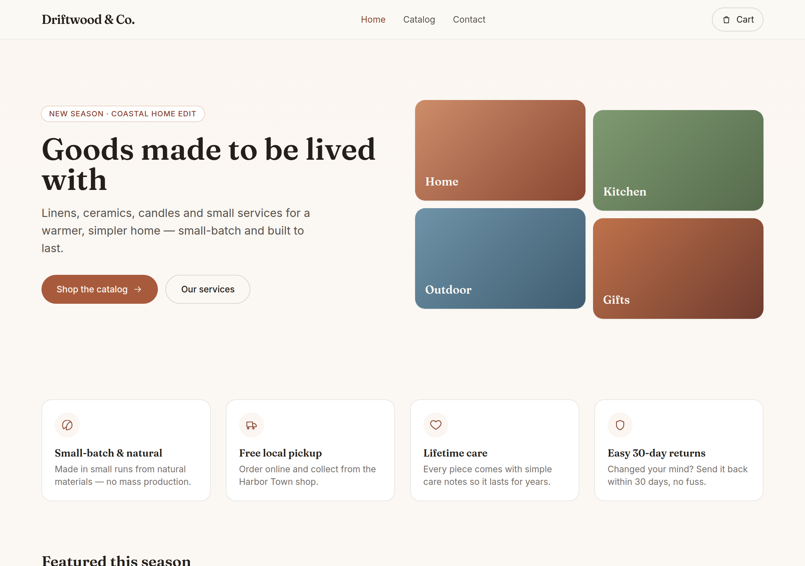
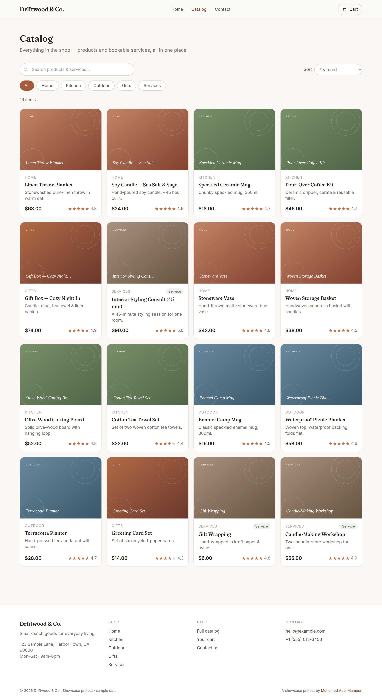
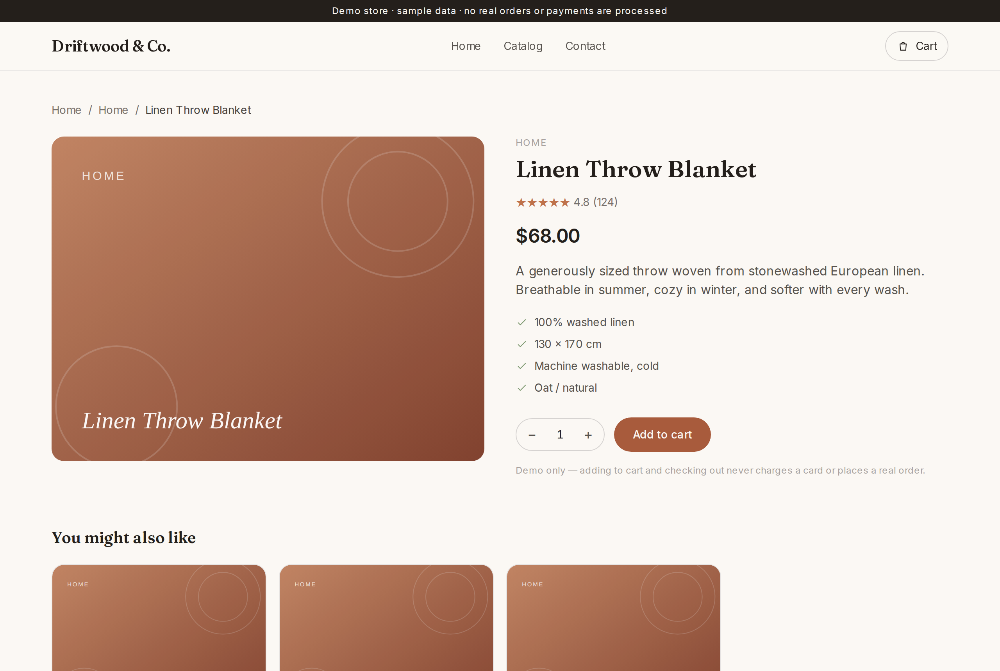
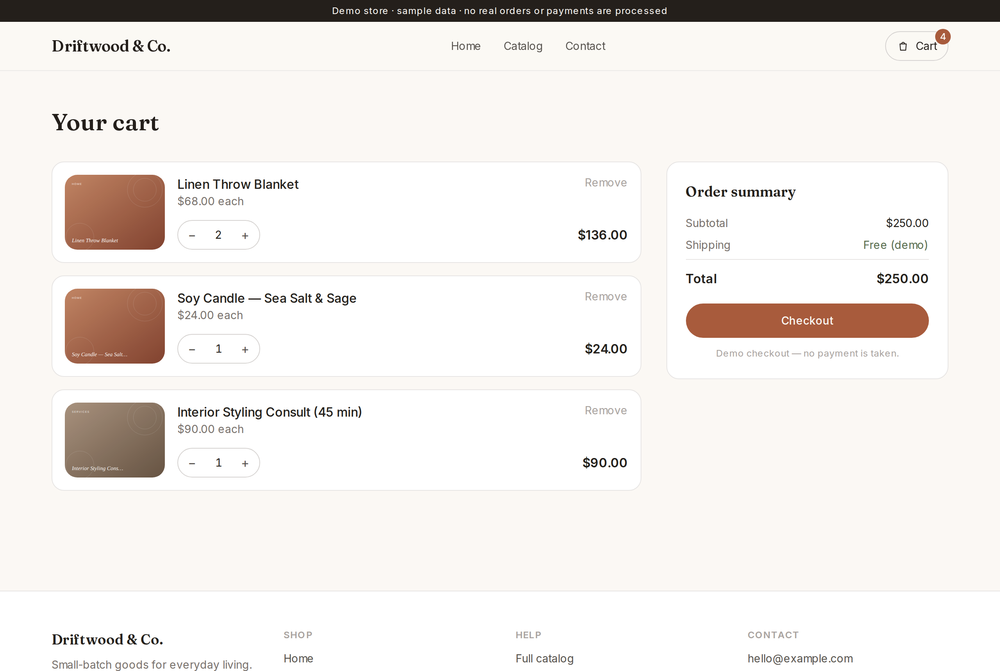
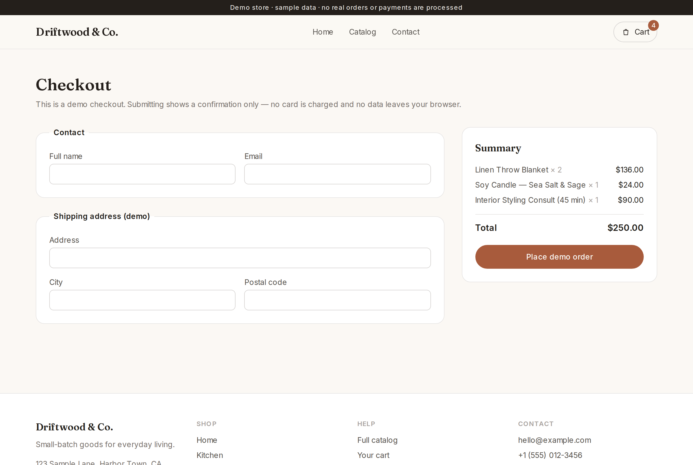
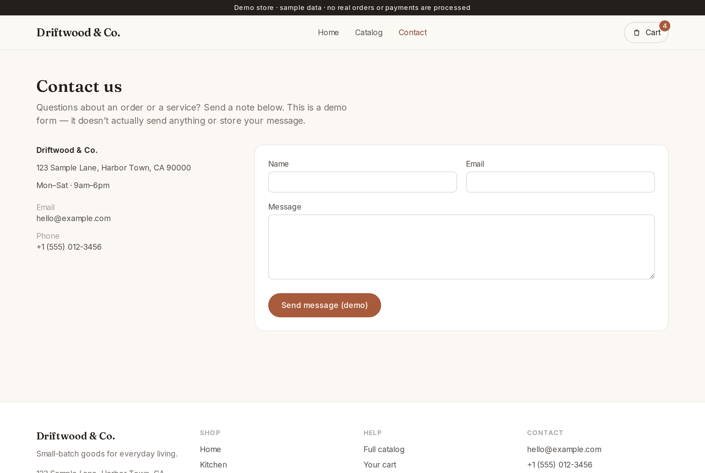

# ShopFront — Small Business Storefront & Landing Site

> A polished, fully responsive storefront and landing site for a small business — filterable product **and** service catalog, product pages, a client‑side cart, and checkout — shipped as a **100% static site** that runs with **zero config**.

[](#deploy)
[](https://nextjs.org)
[](https://www.typescriptlang.org)
[](./LICENSE)

ShopFront proves the **Websites, Landing Pages & E‑commerce** service area: a real, complete, working storefront a small business could actually launch. It’s intentionally backend‑free, so the live site stays up with **zero maintenance and zero running cost**.

> **Showcase project.** All products, prices, reviews and contact details are fictional sample data. Nothing is for sale; checkout never charges a card or places a real order.

---

## Screenshots

| Home / landing | Catalog (filter · search · sort) |
| --- | --- |
|  |  |

| Product detail | Cart |
| --- | --- |
|  |  |

| Checkout | Contact |
| --- | --- |
|  |  |

---

## Features

- **Landing page** — hero, category collage, feature strip, featured products, services callout, testimonials and a newsletter.
- **Filterable catalog** — live client‑side **search**, **category filter** and **sort** (featured / price / rating). Deep‑linkable by category (`/catalog?category=Services`).
- **Products _and_ services** — bookable services (gift wrapping, styling consult, workshop) live in the same catalog, cart and checkout as physical products.
- **Product detail pages** — one statically‑generated page per item, with details, rating, related products and add‑to‑cart.
- **Client‑side cart** — add / remove / change quantity, live subtotal and a header badge, persisted in `localStorage` so it survives refreshes.
- **Checkout** — contact + shipping form → order summary → confirmation with an order number. **No payment, no network, no real order.**
- **Contact form** — client‑side only, with a friendly confirmation.
- **Responsive & accessible** — mobile‑first, keyboard‑friendly, semantic markup, no layout shift.
- **No image assets** — product artwork is generated inline (SVG gradients), so the repo stays light and it needs no media pipeline.

## Tech stack

- **Next.js 15** (App Router) with `output: 'export'` — a self‑contained static `out/` directory
- **TypeScript** (strict)
- **Tailwind CSS**
- Sample catalog as typed data (`data/catalog.ts`); cart in React context + `localStorage`
- Zero runtime dependencies beyond React/Next — **no backend, no database, no API keys**

## Quick start

```bash
git clone https://github.com/MoAdelMamoun/shopfront.git
cd shopfront
npm install
npm run dev          # http://localhost:3000
```

Build the static site:

```bash
npm run build        # emits ./out  (fully static)
npm run start        # serves ./out locally via `npx serve`
```

Other scripts: `npm run typecheck`, `npm run lint`.

## Configuration

ShopFront needs **no configuration to run**. Optionally re‑brand it by copying `.env.example` → `.env.local`:

| Variable | Purpose | Default |
| --- | --- | --- |
| `NEXT_PUBLIC_STORE_NAME` | Store display name | `Driftwood & Co.` |
| `NEXT_PUBLIC_CURRENCY` | Currency symbol shown before prices | `$` |
| `NEXT_PUBLIC_BASE_PATH` | Base path when hosting under a subdirectory (e.g. GitHub Pages project sites) | _(root)_ |

Catalog content lives in `data/catalog.ts` and store copy in `data/site.ts` — edit those to make it your own.

## Sample data & forms

**It runs with zero config and no keys.**

- The catalog, prices, reviews and content are **bundled sample data** (`data/catalog.ts`).
- The cart works entirely in the browser (`localStorage`).
- **Checkout and the contact/newsletter forms are illustrative**: they show a confirmation only. Nothing is sent, stored on a server, or charged.

That means the live build is safe to host publicly forever — there’s nothing to break, no secrets to leak, and no costs to run.

## Deploy

It’s a static site, so host the `out/` directory anywhere:

```bash
npm run build        # produces ./out
```

- **Cloudflare Pages / Netlify / Vercel** — connect the repo, framework “Next.js (static export)” (or build command `npm run build`, output dir `out`). Free tier, root hosting.
- **GitHub Pages** — push `out/` to a `gh-pages` branch (or use an action). For a **project page** served under `/<repo>`, set `NEXT_PUBLIC_BASE_PATH=/shopfront` before building.
- **Any static host / S3 / nginx** — upload the contents of `out/`.

No server, no database, no scheduled jobs — once deployed, the site stays up with zero maintenance.

## Author

Built by **Mohamed Adel Mamoun** — full‑stack developer.
🌐 [mohamedadelmamoun.com](https://mohamedadelmamoun.com)

This is one of a series of open‑source portfolio projects, each proving a different service area. ShopFront proves **Websites, Landing Pages & E‑commerce**.

## License

[MIT](./LICENSE) — free to use, modify and learn from.
